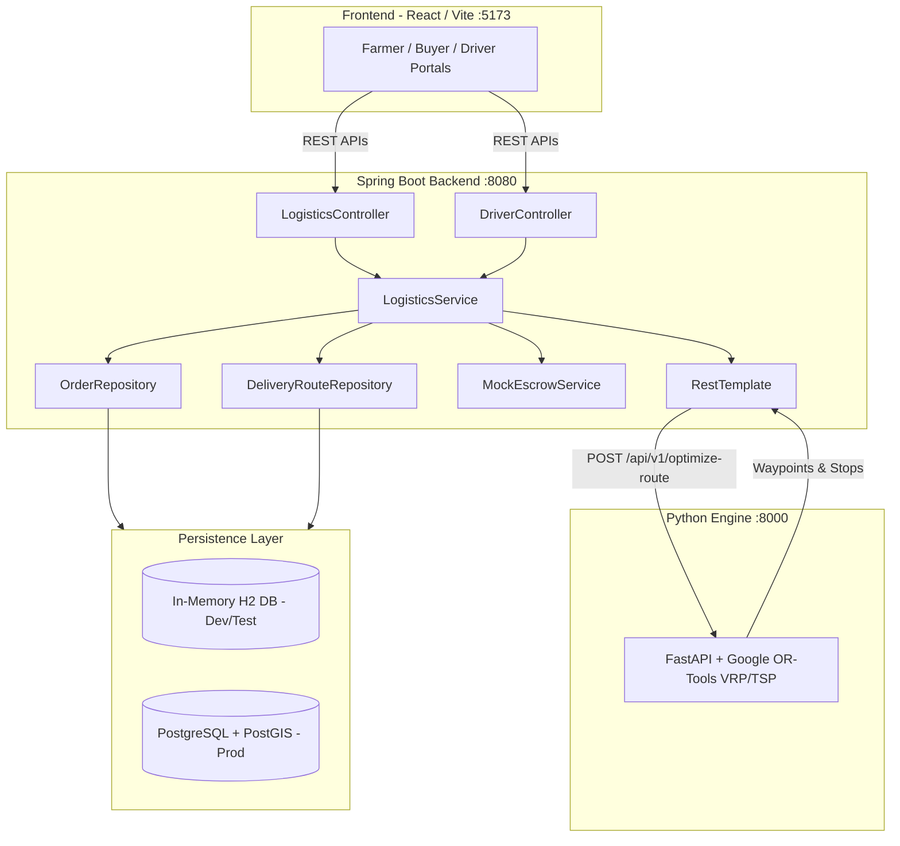

# KrishiMarg Backend

> Intelligent Agricultural Logistics, Multi-Stop Route Optimization & Mock Escrow Platform

The **KrishiMarg Backend** is a Spring Boot service engineered to handle agricultural inventory, buyer procurement, and end-to-end multi-stop fleet logistics. It integrates with an external **Python Google OR-Tools engine** to solve the Vehicle Routing Problem (VRP) / Traveling Salesperson Problem (TSP) for farm pickup and buyer dropoff routes, enforces concurrency-safe driver assignments, and triggers automated mock escrow payouts upon delivery completion.

---

## Table of Contents

- [Architecture Overview](#architecture-overview)
- [Logistics Lifecycle](#logistics-lifecycle)
- [Technology Stack](#technology-stack)
- [Project Directory Structure](#project-directory-structure)
- [Prerequisites](#prerequisites)
- [Step-by-Step Quickstart](#step-by-step-quickstart)
  - [1. Start Python OR-Tools Service](#1-start-python-or-tools-service)
  - [2. Start Spring Boot Backend](#2-start-spring-boot-backend)
- [API Reference & Examples](#api-reference--examples)
  - [1. Trigger Route Optimization](#1-trigger-route-optimization)
  - [2. View Available Routes](#2-view-available-routes)
  - [3. Accept Route](#3-accept-route)
  - [4. Complete Route & Mock Escrow Release](#4-complete-route--mock-escrow-release)
- [Running Automated Tests](#running-automated-tests)
- [Configuration Reference](#configuration-reference)
- [Troubleshooting & FAQs](#troubleshooting--faqs)

---

## Architecture Overview



---

## Logistics Lifecycle

```text
1. Buyer Places Order
       ↓ (Order status: PENDING_ROUTE)
2. Trigger Optimization (POST /api/v1/logistics/optimize-route)
       ↓ (Batches orders, coordinates, lot IDs)
3. Python OR-Tools Solves Route (POST http://localhost:8000/api/v1/optimize-route)
       ↓ (Generates optimal multi-stop sequence and road waypoints)
4. DeliveryRoute Saved & Orders Assigned
       ↓ (Route status: PENDING_DRIVER; Order status: ROUTE_ASSIGNED)
5. Driver Portal Fetches Routes (GET /api/v1/driver/routes)
       ↓ (Displays route distance, estimated payout, map path)
6. Driver Accepts Route (POST /api/v1/driver/routes/{id}/accept)
       ↓ (Route status: ACCEPTED; prevents duplicate claims with HTTP 409)
7. Driver Completes Route (POST /api/v1/driver/routes/{id}/complete)
       ↓ (Route status: COMPLETED; Order status: DELIVERED)
8. Mock Escrow Released
       ↓ (Calculates and releases farmer produce payouts & driver travel fare)
```

---

## Technology Stack

* **Language**: Java 17+
* **Framework**: Spring Boot 4.1 / Spring 7
* **Data & Persistence**: Spring Data JPA, Hibernate 7, Hibernate Spatial
* **Databases**:
  * **Development & Testing**: In-Memory H2 database (zero setup required)
  * **Production**: PostgreSQL 14+ with PostGIS extensions
* **Route Optimizer**: Python 3.10+, FastAPI, Uvicorn, Google OR-Tools
* **HTTP Client**: Spring `RestTemplate` with connection pooling & timeouts
* **Testing**: JUnit 5, Mockito, Spring MVC MockMvc, AssertJ

---

## Project Directory Structure

```text
backend/
├── pom.xml                                      # Maven project configuration & dependencies
├── mvnw / mvnw.cmd                              # Maven wrapper executables
│
├── src/
│   ├── main/
│   │   ├── java/com/krishimarg/backend/
│   │   │   ├── BackendApplication.java          # Spring Boot main class
│   │   │   │
│   │   │   ├── config/                          # Configuration & Lifecycle beans
│   │   │   │   ├── AppConfig.java               # RestTemplate timeouts & CORS settings
│   │   │   │   └── DataInitializer.java         # Initial test data loader (Users & Orders)
│   │   │   │
│   │   │   ├── controllers/                     # REST API Controllers (Thin Layer)
│   │   │   │   ├── DriverController.java        # Driver routes, acceptance & completion
│   │   │   │   └── LogisticsController.java     # Route optimization endpoint
│   │   │   │
│   │   │   ├── dto/                             # Data Transfer Objects (Bidirectional API Contracts)
│   │   │   │   ├── AcceptRouteRequest.java      # Driver ID payload
│   │   │   │   ├── DriverRouteResponse.java     # Route DTO with coordinates & stop details
│   │   │   │   ├── OptimizeRouteOrderItem.java  # Order batch item sent to Python
│   │   │   │   ├── OptimizeRoutePythonResponse.java # DTO parsing Python response
│   │   │   │   ├── OptimizeRouteRequest.java    # Wrapper for Python request payload
│   │   │   │   ├── OptimizeRouteResponse.java   # Response for optimization trigger
│   │   │   │   ├── OrderedStopDto.java          # Stop item (PICKUP/DROPOFF with lat/lng)
│   │   │   │   ├── RouteActionResponse.java     # Accept/Complete action response
│   │   │   │   └── RouteCoordinate.java         # Coordinate DTO ({lat, lng} or [lat, lng])
│   │   │   │
│   │   │   ├── exceptions/                      # Centralized Exception Handling
│   │   │   │   ├── GlobalExceptionHandler.java  # @RestControllerAdvice (400, 403, 404, 409, 503)
│   │   │   │   ├── InvalidRouteStateException.java   # HTTP 400 Bad Request
│   │   │   │   ├── RouteAlreadyAcceptedException.java # HTTP 409 Conflict
│   │   │   │   ├── RouteNotFoundException.java        # HTTP 404 Not Found
│   │   │   │   ├── RouteOptimizerUnavailableException.java # HTTP 503 Service Unavailable
│   │   │   │   └── UnauthorizedDriverException.java  # HTTP 403 Forbidden
│   │   │   │
│   │   │   ├── models/                          # JPA Entities (Database Tables)
│   │   │   │   ├── DeliveryRoute.java           # Maps 'delivery_routes'
│   │   │   │   ├── Order.java                   # Maps 'orders'
│   │   │   │   └── User.java                    # Maps 'users' (FARMER, BUYER, DRIVER)
│   │   │   │
│   │   │   ├── repositories/                    # Spring Data Repositories
│   │   │   │   ├── DeliveryRouteRepository.java # Route query interface
│   │   │   │   ├── OrderRepository.java         # Order query interface
│   │   │   │   └── UserRepository.java          # User query interface
│   │   │   │
│   │   │   └── services/                        # Business Logic & Integration Layer
│   │   │       ├── LogisticsService.java        # Route optimization, status lifecycle & validation
│   │   │       └── MockEscrowService.java       # Simulated payment calculation & release
│   │   │
│   │   └── resources/
│   │       ├── application.properties           # Production profile (PostgreSQL)
│   │       ├── application-dev.properties       # Development profile (In-Memory H2)
│   │       └── db/
│   │           └── init.sql                     # Production PostgreSQL schema & seeds
│   │
│   └── test/
│       ├── java/com/krishimarg/backend/
│       │   ├── BackendApplicationTests.java     # Context load test
│       │   ├── LogisticsAndDriverControllerTest.java # MockMvc controller endpoint tests (9 tests)
│       │   └── LogisticsServiceTest.java        # Complete business logic unit tests (10 tests)
│       │
│       └── resources/
│           └── application-test.properties      # Test profile settings
```

---

## Prerequisites

1. **Java Development Kit (JDK)**: Version 17 or 21+. Verify using:
   ```bash
   java -version
   ```
2. **Python**: Version 3.10+ with `pip`. Verify using:
   ```bash
   python --version
   ```

---

## Step-by-Step Quickstart

### 1. Start Python OR-Tools Service

The Python microservice listens on port `8000` to calculate distance matrices and solve multi-stop vehicle routes.

In **Terminal 1**:

```powershell
cd c:\project\KrishiMarg-main\python_service

# Install dependencies (only needed once)
pip install -r requirements.txt

# Start the optimization engine
python optimizer_service.py
```

*Output:*
```text
INFO:     Started server process
INFO:     Application startup complete.
INFO:     Uvicorn running on http://0.0.0.0:8000
```

---

### 2. Start Spring Boot Backend

The backend listens on port `8080`. By default, using the `dev` profile enables an in-memory database and seeds initial data (`f_101`, `b_501`, `d_801`, and `ord_7701`, `ord_7702`), meaning **no external database installation is required**.

In **Terminal 2**:

```powershell
cd c:\project\KrishiMarg-main\backend

# Run in development mode (In-Memory H2 DB)
.\mvnw.cmd spring-boot:run "-Dspring-boot.run.profiles=dev"
```

*Output:*
```text
Tomcat started on port 8080 (http) with context path '/'
Started BackendApplication in 3.3 seconds
Seeded 4 users.
Seeded 2 PENDING_ROUTE orders: ord_7701, ord_7702
```

> **Note for Production**: To run against a PostgreSQL server, ensure PostgreSQL is running on port 5432, execute `src/main/resources/db/init.sql`, and launch without profile overrides: `.\mvnw.cmd spring-boot:run`.

---

## API Reference & Examples

### 1. Trigger Route Optimization

Batches all `PENDING_ROUTE` orders, calls Python OR-Tools, generates an optimal route, and transitions orders to `ROUTE_ASSIGNED`.

* **Endpoint**: `POST /api/v1/logistics/optimize-route`
* **cURL**:
  ```bash
  curl -X POST http://localhost:8080/api/v1/logistics/optimize-route
  ```
* **PowerShell**:
  ```powershell
  Invoke-RestMethod -Uri "http://localhost:8080/api/v1/logistics/optimize-route" -Method Post | ConvertTo-Json -Depth 5
  ```
* **Response (200 OK)**:
  ```json
  {
    "success": true,
    "message": "Route optimized successfully",
    "routeId": "route_5eac2f",
    "routeCoordinates": [
      { "latitude": 18.3489, "longitude": 74.0312 },
      { "latitude": 18.3245, "longitude": 74.0118 },
      { "latitude": 18.5018, "longitude": 73.8636 }
    ],
    "total_distance_km": 31.0,
    "ordered_stops": [
      { "type": "PICKUP", "lot_id": "lot_901", "latitude": 18.3489, "longitude": 74.0312 },
      { "type": "PICKUP", "lot_id": "lot_902", "latitude": 18.3245, "longitude": 74.0118 },
      { "type": "DROPOFF", "order_id": "ord_7701", "latitude": 18.5018, "longitude": 73.8636 }
    ]
  }
  ```

---

### 2. View Available Routes

Retrieves routes available for drivers (`PENDING_DRIVER` / `PENDING`), including coordinate paths and estimated payout.

* **Endpoint**: `GET /api/v1/driver/routes`
* **Query Parameters** (Optional): `lat`, `lng`, `driver_id`
* **cURL**:
  ```bash
  curl http://localhost:8080/api/v1/driver/routes?lat=18.4&lng=73.9
  ```
* **PowerShell**:
  ```powershell
  Invoke-RestMethod -Uri "http://localhost:8080/api/v1/driver/routes" -Method Get | ConvertTo-Json -Depth 5
  ```
* **Response (200 OK)**:
  ```json
  [
    {
      "routeId": "route_5eac2f",
      "status": "PENDING_DRIVER",
      "totalDistanceKm": 31.0,
      "pickupCount": 3,
      "dropoffCount": 2,
      "estimatedPayout": 975.00,
      "routeCoordinates": [
        { "latitude": 18.3489, "longitude": 74.0312 },
        { "latitude": 18.5018, "longitude": 73.8636 }
      ]
    }
  ]
  ```

---

### 3. Accept Route

A driver claims an available route. Assigns the driver ID and transitions status to `ACCEPTED`. Rejects concurrent claims with `409 Conflict`.

* **Endpoint**: `POST /api/v1/driver/routes/{routeId}/accept`
* **cURL**:
  ```bash
  curl -X POST http://localhost:8080/api/v1/driver/routes/route_5eac2f/accept \
    -H "Content-Type: application/json" \
    -d '{"driver_id": "d_801"}'
  ```
* **PowerShell**:
  ```powershell
  Invoke-RestMethod -Uri "http://localhost:8080/api/v1/driver/routes/route_5eac2f/accept" `
    -Method Post -ContentType "application/json" -Body '{"driver_id":"d_801"}' | ConvertTo-Json
  ```
* **Response (200 OK)**:
  ```json
  {
    "success": true,
    "message": "Route accepted successfully",
    "routeId": "route_5eac2f",
    "status": "ACCEPTED"
  }
  ```
* **Error Response (409 Conflict - Second Driver Attempt)**:
  ```json
  {
    "success": false,
    "message": "Route route_5eac2f has already been accepted by another driver"
  }
  ```

---

### 4. Complete Route & Mock Escrow Release

Driver finishes all deliveries. Transitions route to `COMPLETED`, records `completed_at`, marks all orders as `DELIVERED`, and releases simulated escrow funds to farmers and the driver.

* **Endpoint**: `POST /api/v1/driver/routes/{routeId}/complete`
* **cURL**:
  ```bash
  curl -X POST http://localhost:8080/api/v1/driver/routes/route_5eac2f/complete \
    -H "Content-Type: application/json" \
    -d '{"driver_id": "d_801"}'
  ```
* **PowerShell**:
  ```powershell
  Invoke-RestMethod -Uri "http://localhost:8080/api/v1/driver/routes/route_5eac2f/complete" `
    -Method Post -ContentType "application/json" -Body '{"driver_id":"d_801"}' | ConvertTo-Json
  ```
* **Response (200 OK)**:
  ```json
  {
    "success": true,
    "message": "Route completed and mock escrow released",
    "routeId": "route_5eac2f",
    "status": "COMPLETED",
    "payout_status": "MOCK_ESCROW_RELEASED"
  }
  ```
* **Error Response (403 Forbidden - Unauthorized Driver)**:
  ```json
  {
    "success": false,
    "message": "Driver d_999 is not authorized to complete route route_5eac2f assigned to d_801"
  }
  ```

---

## Running Automated Tests

The test suite contains 20 comprehensive unit and integration tests covering all state transitions, exception cases, Python service outages, and MockMvc REST endpoints.

To run all tests:

```powershell
cd c:\project\KrishiMarg-main\backend
.\mvnw.cmd test
```

*Expected Result:*
```text
[INFO] Running com.krishimarg.backend.BackendApplicationTests
[INFO] Tests run: 1, Failures: 0, Errors: 0, Skipped: 0
[INFO] Running com.krishimarg.backend.LogisticsAndDriverControllerTest
[INFO] Tests run: 9, Failures: 0, Errors: 0, Skipped: 0
[INFO] Running com.krishimarg.backend.LogisticsServiceTest
[INFO] Tests run: 10, Failures: 0, Errors: 0, Skipped: 0
[INFO] ------------------------------------------------------------------------
[INFO] BUILD SUCCESS
[INFO] Total time: 9.5 s
[INFO] Tests run: 20, Failures: 0, Errors: 0, Skipped: 0
```

---

## Configuration Reference

Key properties in `application.properties` and `application-dev.properties`:

| Property | Default Value | Description |
|---|---|---|
| `server.port` | `8080` | Backend HTTP server port |
| `route.optimizer.url` | `http://localhost:8000/api/v1/optimize-route` | Python OR-Tools microservice URL |
| `route.optimizer.connect-timeout-ms` | `5000` | HTTP connect timeout in ms |
| `route.optimizer.read-timeout-ms` | `10000` | HTTP read timeout in ms |
| `logistics.driver.base-fare` | `200.00` | Base driver payout in ₹ |
| `logistics.driver.per-km-rate` | `25.00` | Per-kilometer driver rate in ₹ |
| `spring.datasource.url` | PostgreSQL / H2 mem | Database connection string |
| `spring.jpa.hibernate.ddl-auto` | `update` | DDL generation policy |
| `spring.jpa.open-in-view` | `false` | Disables Open-Session-In-View pattern |

---

## Troubleshooting & FAQs

### Q: Why does the terminal not return a prompt after running `.\mvnw.cmd spring-boot:run`?
**A:** Spring Boot runs an embedded Tomcat web server in the foreground. It keeps the terminal busy listening for requests. To run test requests, open a second terminal window or use Postman/curl. Pressing `Ctrl + C` stops the server.

### Q: What happens if the Python optimizer service is down when optimizing routes?
**A:** `LogisticsService` catches `ResourceAccessException` / `RestClientException` and throws `RouteOptimizerUnavailableException`. The global exception handler converts this to a clean `503 Service Unavailable` response with an explanatory message:
```json
{
  "success": false,
  "message": "Route optimization service is unavailable: Connection refused"
}
```

### Q: How is concurrency handled when two drivers accept the same route?
**A:** `LogisticsService.acceptRoute()` performs an atomic check-and-update. If the route status is already `ACCEPTED` by another driver, it immediately rejects the request with `HTTP 409 Conflict`, ensuring a route cannot be double-booked.
